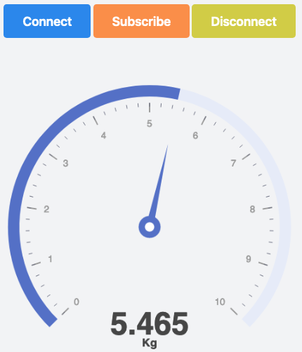

# Web load cell

In this project I used a load cell with ESP32 publishing on an MQTT server Mosquitto on Digital Ocean, with this, making it acessible from the browser.

```
.
├── README.md
├── esp32
│   ├── include
│   │   └── README
│   ├── lib
│   │   └── README
│   ├── platformio.ini
│   ├── src
│   │   └── main.cpp
│   └── test
│       └── README
├── mosquitto
│   └── mosquitto.conf
├── nginx
│   ├── connection.js
│   ├── index.html
│   ├── mqttws31.js
│   └── styles.css
└── prints
    ├── connect.png
    ├── interface.png
    ├── schematic.png
    └── subscribe.png
```

### ESP32
For menage files on ESP32 was used PlatformIO extesion in vscode, so this direcotry is the entire PlatformIO project, it can imported direct.  

This is the connections between ESP32 and load cell. This schematic was made on Fritzing software. 


### MQTT   
mqtt directory contains the conf file of mosquitto, this file stay orinaly in /etc/mosquitto.conf. The only difference between original file and this file is the two lines above, that enable web socks for connection with wint Eclipse Paho JavaScript Client.

```
listener 8080
protocol websockets
``` 


### Front-end 

To make connection between front-end and mosquitto was used a lib called Eclipse Paho JavaScript Client. This files stay inside the nginx directory.

For the chart was used another lib, called Echarts, it can accessed from this link: <https://echarts.apache.org/en/index.html>


### Prints

This prints shows how front-end is. 

First you have to click in connection, for make connection between front-end and mosquitto server.


Then you have to click in subscribe to receive esp32 publications on mosquitto server.


And then will appear the chart contains weight in Kg unit. 




