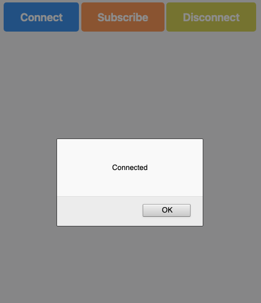

# Web load cell

In this project I used a load cell with ESP32 publishing on an MQTT server Mosquitto on Digital Ocean, with this, making it acessible from the browser.

To make connection between front-end and mosquitto was used a lib called Eclipse Paho JavaScript Client. This files stay inside the nginx directory.

│   
## ESP32
│   
├── esp32
│   
## MQTT   
│   
│   
├── mosquitto
│   └── mosquitto.conf
│   
# Front-end 
│   
│   
├── nginx
│   ├── connection.js
│   ├── index.html
│   ├── mqttws31.js
│   └── styles.css
│   
## Imagens  
│   
└── prints
    ├── connect.png
    ├── interface.png
    └── subscribe.png

